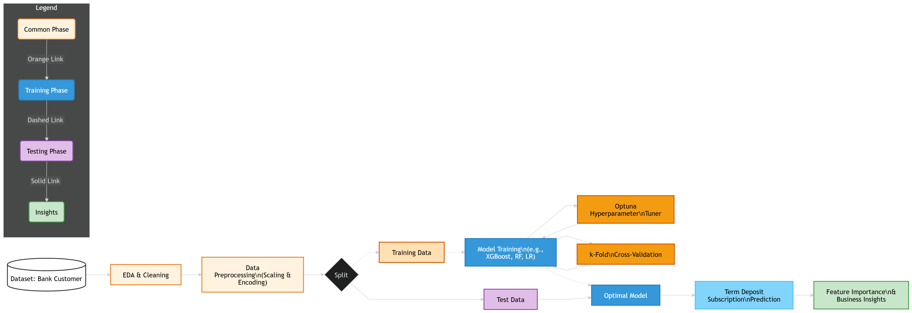

# **Bank Customer Behavior Prediction: Term Deposit**

## **Deskripsi Proyek**
Proyek ini dikerjakan sebagai bagian dari kompetisi Data Quest yang diselenggarakan oleh Data Science Indonesia dalam rangka perayaan ulang tahun ke-10 mereka. Kompetisi ini menantang peserta untuk membangun model *machine learning* yang dapat memprediksi perilaku nasabah perbankan.

## **Latar Belakang & Tujuan Bisnis**
Dalam industri perbankan, memahami perilaku nasabah sangat krusial untuk meningkatkan efektivitas kampanye pemasaran. Tantangan utamanya adalah mengidentifikasi nasabah mana yang berpotensi merespons positif terhadap penawaran produk keuangan tertentu, seperti deposito berjangka. 

Tujuan proyek ini adalah membuat model klasifikasi untuk memprediksi apakah seorang nasabah akan membeli produk deposito berjangka (1) atau tidak (0). Hasil prediksi ini dapat membantu tim *marketing* perbankan untuk menargetkan kampanye secara lebih efisien, menghemat biaya pemasaran, dan meningkatkan konversi.

## **Wawasan Eksplorasi Data (EDA Insights)**
Dari visualisasi dan analisis deskriptif data, beberapa temuan kunci terkait karakteristik nasabah adalah:

* **Imbalanced Class yang Ekstrem:** Hanya sekitar 11,4% nasabah di data *training* yang berlangganan deposito, sisanya 88,6% tidak. Ini adalah tantangan utama yang harus diatasi pada fase pemodelan.
* **Profil Mayoritas Nasabah:** Didominasi oleh individu yang bekerja sebagai "sosial media specialis" (5.755 orang), berstatus "menikah" (13.858 orang), dan memiliki latar belakang "Pendidikan Tinggi".
* **Status Finansial:** Menariknya, walau mayoritas nasabah memiliki beban pinjaman rumah (12.053 orang), sebagian besar dari mereka terbebas dari pinjaman pribadi (18.888 orang).
* **Indikator Ekonomi Makro:** Rata-rata indeks harga konsumen berada di 93.58 dengan tingkat kepercayaan konsumen yang cenderung negatif (-40.49), yang mungkin mempengaruhi minat mereka mengunci uang di deposito.

## **Pipeline Metodologi Prapemrosesan & Pemodelan**

---
*Dibuat oleh Muhammad Abil Hasan*
